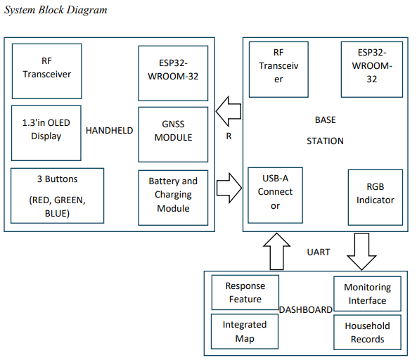
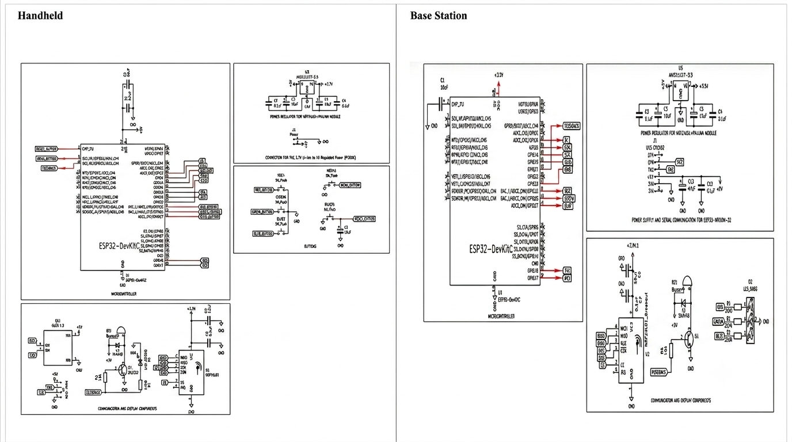
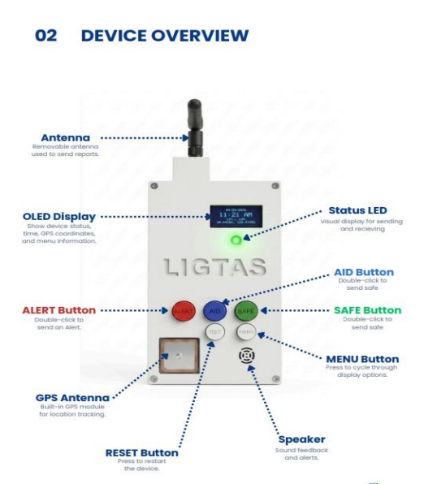
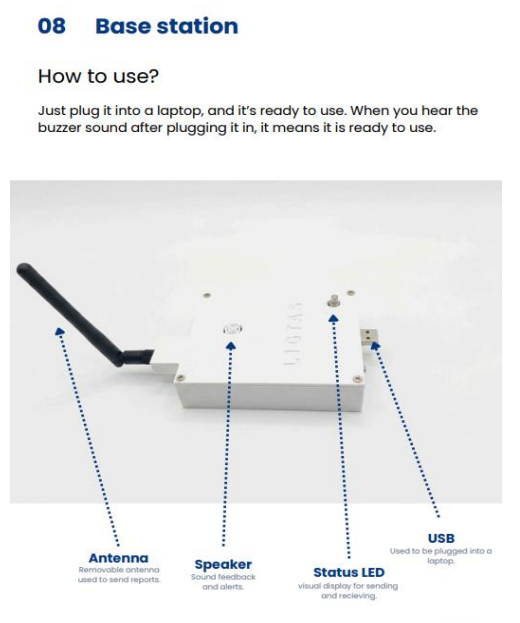
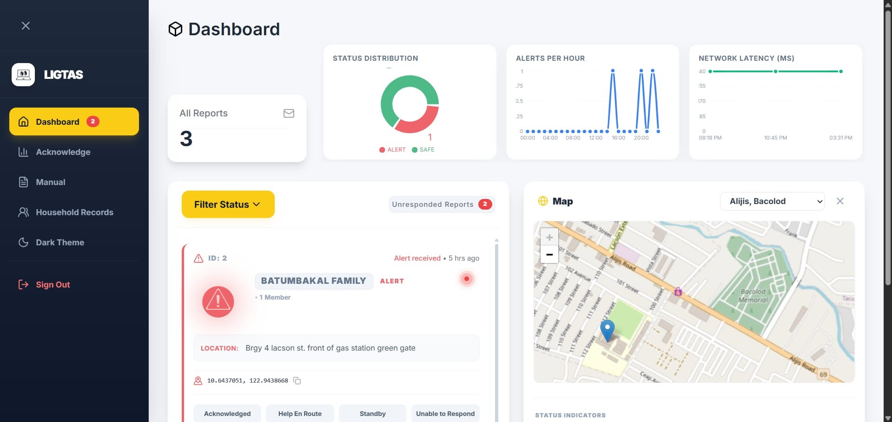

# LIGTAS: RF and GNSS Emergency Alert System for Disaster Response

## Overview

LIGTAS is a community-level emergency communication system designed to operate independently of cellular networks and internet connectivity. The system enables users to transmit emergency status messages along with GNSS-based location, date, and time information to a local monitoring station through RF communication.

The project was developed to provide an alternative communication method during disasters and emergency situations where conventional communication infrastructure may become unavailable.

---

## Features

### Handheld Device

* Emergency, Assistance, and Safe status transmission
* GNSS-based location tracking using NEO-M8N
* Date and time acquisition from GNSS satellites
* OLED display for user feedback
* Audible and visual notifications through buzzer and LEDs
* Message acknowledgment handling
* Unique device identification

### Base Station

* Receives RF transmissions from handheld devices
* Validates and processes incoming packets
* Sends acknowledgments and responses
* Relays information to a local monitoring dashboard
* Supports up to 6 handheld devices

### Monitoring Dashboard

* Real-time user status monitoring
* Location and timestamp visualization
* Alert notification system
* Local data storage and tracking

---

## System Architecture



---

## Circuit Diagram



---

## Handheld Device



---

## Base Station



---

## Dashboard Interface



---

## Hardware Components

| Component           | Function                             |
| ------------------- | ------------------------------------ |
| ESP32-WROOM-32      | Main microcontroller                 |
| nRF24L01+ PA + LNA  | RF communication                     |
| NEO-M8N GNSS Module | Location, date, and time acquisition |
| OLED Display        | User interface                       |
| Push Buttons        | Status selection                     |
| LEDs                | Visual indicators                    |
| Buzzer              | Audible alerts                       |

---

## Communication Protocol

The system utilizes the nRF24L01+ PA + LNA transceiver operating with Enhanced ShockBurst (ESB) protocol for reliable packet-based communication.

Each packet contains:

* UTC Timestamp
* Packet Type
* Device ID
* Latitude
* Longitude
* Status
* Message ID
* Response Code

The protocol supports acknowledgment handling, duplicate detection, and reliable message delivery.

---

## Repository Structure

```text
├── base_station/
│   ├── base_station.ino
│   └── payload_struct.h
│
├── handheld/
│   ├── handheld.ino
│   └── payload_struct.h
│
├── images/
│   ├── system-architecture.png
│   ├── circuit-diagram.png
│   ├── handheld-device.jpg
│   ├── base-station.jpg
│   └── dashboard.png
│
└── README.md
```

---

## My Contributions

This repository primarily contains my contributions to the capstone project, including:

* ESP32 firmware development
* RF communication implementation using nRF24L01+ PA + LNA
* Packet structure and communication protocol design
* GNSS integration using NEO-M8N
* OLED user interface development
* Status transmission logic
* ACK and response handling
* Base station packet reception and validation
* Hardware integration and testing
* System debugging and optimization

---

## Related Repositories

### Dashboard Repository

[LIGTAS-DASHBOARD](https://github.com/Andoyyy-rakon/LIGTAS-DASHBOARD)   

---

## Research Information

**Project Title:**
LIGTAS: RF and GNSS Emergency Alert System for Disaster Response

**Program:**
Bachelor of Science in Computer Engineering

**Purpose:**
To provide a accessible, community-level emergency communication system capable of operating without cellular or internet infrastructure during disasters.

---

## Future Improvements

* Implement Multiple Handhelds and Base Stations
* Use LoRa for better range and support capabilities
* RF mesh networking
* Message encryption
* Mobile application integration
* Battery optimization
* Additional environmental sensors
* Improved location visualization

---

## License

This project is intended for academic, research, and educational purposes.
